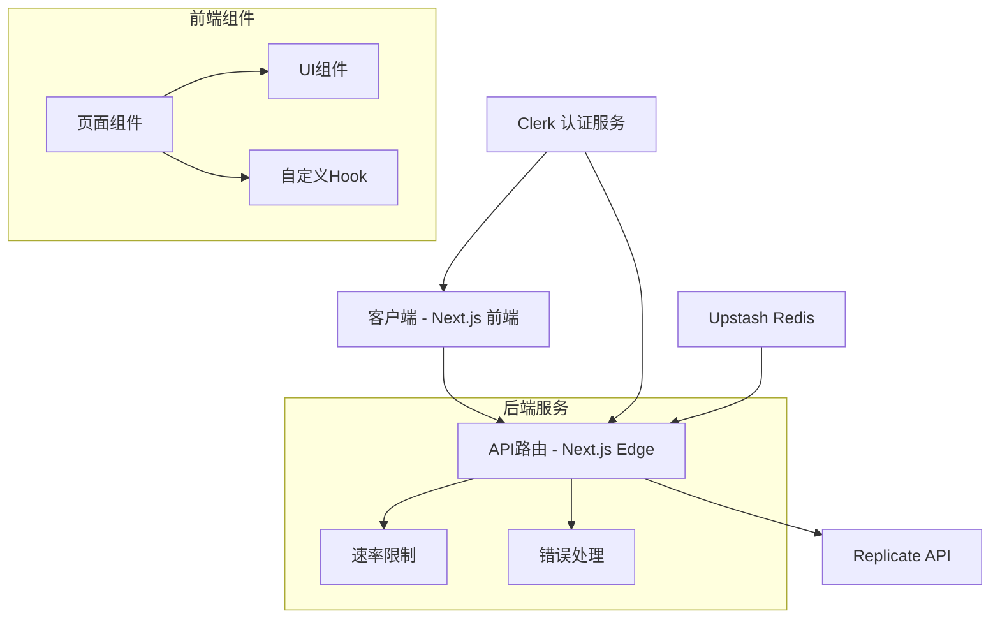
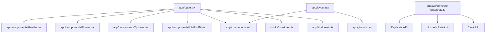
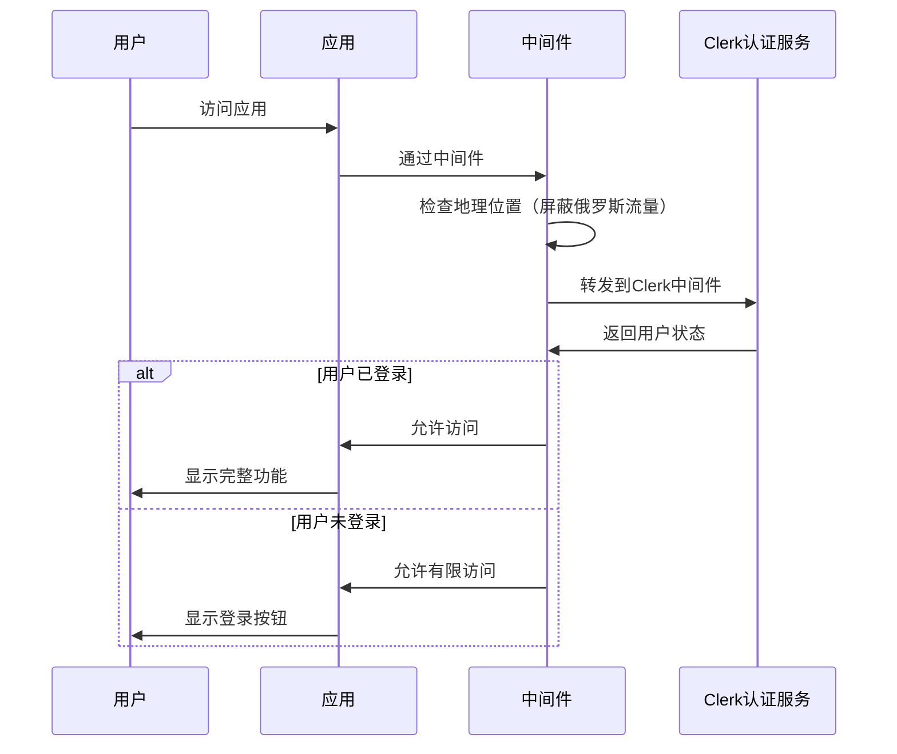

# LogoCreator 项目文档

## 项目概览

**项目名称**：Logo Creator (AI Logo Generator)

**项目简介**：一个开源的AI驱动的Logo生成器，允许用户通过自定义样式、颜色和公司名称快速创建专业级别的标志。

**编程语言和框架**：
- TypeScript / JavaScript
- Next.js (React框架)
- Tailwind CSS (样式)
- Shadcn UI (组件库)

**代码仓库**：https://github.com/Nutlope/logocreator

**文档目标读者**：新加入的开发人员和项目贡献者

## 整体架构概览

LogoCreator是一个基于Next.js的Web应用，采用客户端-服务器架构，通过AI模型生成定制化的Logo。



项目结构主要分为以下几个部分：
1. **UI界面**：基于Next.js的页面组件和Shadcn UI组件库
2. **API接口**：处理logo生成请求的Edge函数
3. **认证系统**：使用Clerk处理用户认证
4. **AI集成**：通过Replicate API接入Flux Pro 1.1模型
5. **速率限制**：使用Upstash Redis实现API调用限制

## 代码文件依赖关系



核心依赖：
- app/page.tsx：主页面组件，包含Logo生成表单和预览
- app/api/generate-logo/route.ts：处理Logo生成请求的API路由
- app/components/ui/：包含各种UI组件如按钮、输入框、对话框等
- hooks/use-toast.ts：通知提示Hook
- app/layout.tsx：应用根布局，包含全局配置

## 功能模块调用逻辑

### Logo生成流程

1. **用户输入阶段**
   - 用户在前端界面（app/page.tsx）填写表单
   - 表单包括：公司名称、Logo样式选择、颜色选择和额外信息
   - 可选择使用自己的Replicate API密钥

2. **请求处理阶段**
   ```mermaid
   sequenceDiagram
       participant User as 用户
       participant FrontEnd as 前端页面
       participant API as API路由
       participant Auth as Clerk认证
       participant RateLimit as 速率限制
       participant AI as Replicate API

       User->>FrontEnd: 填写Logo信息并提交
       FrontEnd->>Auth: 验证用户登录状态
       FrontEnd->>API: 发送生成请求
       API->>Auth: 确认用户身份
       
       alt 使用用户自己的API密钥
           API->>AI: 使用用户API密钥请求生成
       else 使用系统API密钥
           API->>RateLimit: 检查用户配额
           alt 配额足够
               RateLimit->>API: 允许请求
               API->>AI: 使用系统API密钥请求生成
           else 配额不足
               RateLimit->>API: 拒绝请求
               API->>FrontEnd: 返回配额不足错误
           end
       end
       
       AI->>API: 返回生成的Logo图像
       API->>FrontEnd: 返回Base64编码的图像
       FrontEnd->>User: 显示生成的Logo
   ```

3. **图像生成阶段**
   - 根据用户选择的样式设置对应的提示词
   - 调用Replicate API的Flux Pro 1.1模型生成图像
   - 处理各种错误情况（API密钥无效、模型访问受限等）

### 认证流程



## 关键代码文件位置索引

| 文件路径 | 描述 |
|---------|------|
| app/page.tsx | 主页面组件，包含Logo生成表单和预览UI |
| app/api/generate-logo/route.ts | API路由，处理Logo生成请求，集成Replicate API |
| app/layout.tsx | 应用根布局，设置元数据和全局样式 |
| app/components/ui/ | UI组件库，包含按钮、输入框、选择器等基础组件 |
| app/components/Header.tsx | 网站头部导航组件 |
| app/components/Footer.tsx | 网站底部组件 |
| hooks/use-toast.ts | 通知提示系统Hook |
| middleware.ts | 中间件，处理认证和地理位置限制 |
| app/lib/domain.ts | 域名配置工具 |
| tailwind.config.ts | Tailwind CSS配置文件 |

## 技术特点

1. **边缘计算**：使用Next.js Edge Runtime处理API请求，提高全球响应速度
2. **速率限制**：通过Upstash Redis实现用户API调用的配额管理
3. **认证系统**：集成Clerk提供安全的用户认证
4. **响应式设计**：使用Tailwind CSS实现适配各种设备的UI
5. **AI模型集成**：对接Replicate API的高质量图像生成模型

## Logo生成策略

系统支持多种Logo样式：
- Tech：技术风格，简约、锐利、电影感
- Flashy：醒目风格，使用霓虹色和金属质感
- Modern：现代风格，扁平设计、几何形状
- Playful：俏皮风格，明亮大胆的颜色
- Abstract：抽象风格，艺术创意
- Minimal：极简风格，简洁、永恒、单色

每种风格使用特定的提示词指导AI生成对应风格的Logo。

## 部署说明

1. 克隆代码仓库：`git clone https://github.com/Nutlope/logocreator`
2. 创建`.env`文件并添加必要的环境变量：
   - REPLICATE_API_TOKEN：Replicate的API密钥
   - 其他可选：UPSTASH_REDIS_REST_URL, UPSTASH_REDIS_REST_TOKEN等
3. 安装依赖：`npm install`
4. 本地运行：`npm run dev`
5. 构建生产版本：`npm run build`

## 项目设计模式和命名约定

- **组件命名**：采用PascalCase（如Header.tsx, Footer.tsx）
- **功能函数命名**：采用camelCase（如generateLogo）
- **设计模式**：
  - 状态管理：使用React Hooks管理状态
  - 组件复用：可重用UI组件封装在components/ui目录下
  - API路由：使用Next.js API Routes实现后端功能

## 未来发展方向

根据README.md中未完成的任务:
1. 创建用户Logo历史记录仪表板
2. 支持SVG格式导出
3. 添加更多Logo样式选项
4. 增加图像尺寸选择功能
5. 显示使用自己API密钥时的近似价格
6. 允许上传参考Logo
7. 重新设计知名品牌Logo并展示

## 结论

LogoCreator是一个功能完善的AI Logo生成工具，通过直观的界面和强大的AI模型生成专业质量的Logo。该项目展示了现代Web开发和AI技术的结合，为开发人员提供了一个学习Next.js、Tailwind CSS和AI集成的优秀案例。
